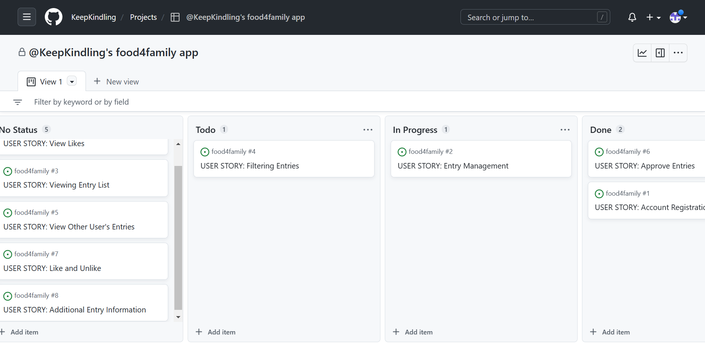
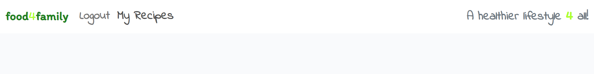
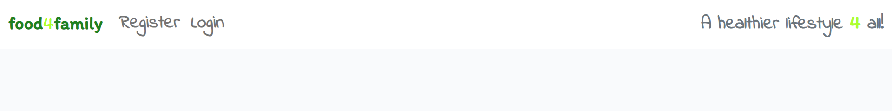
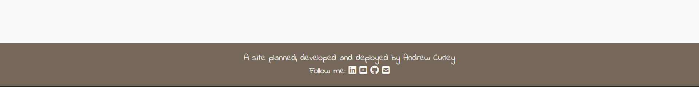
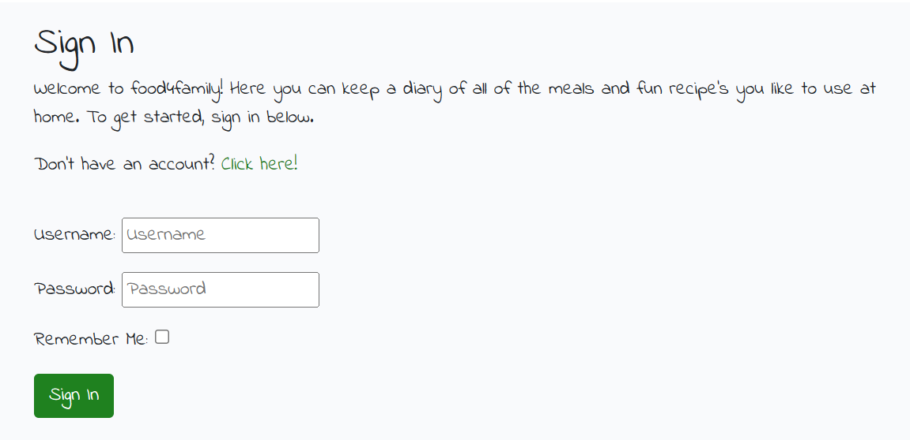
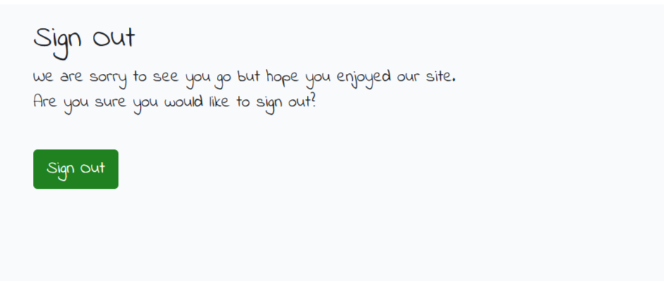
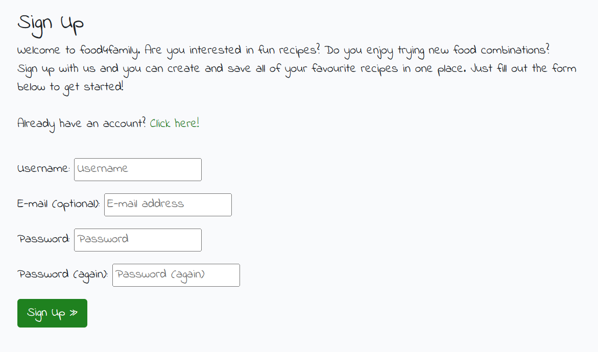
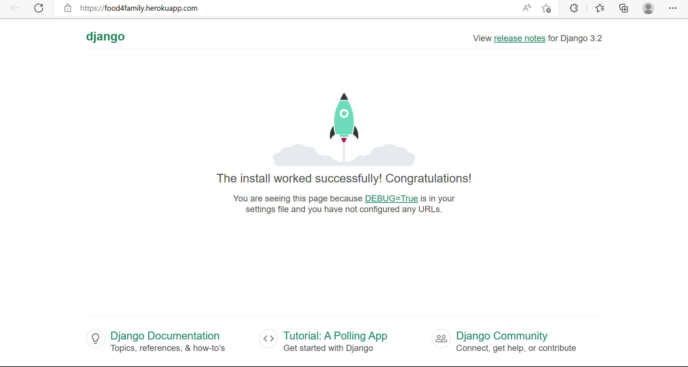
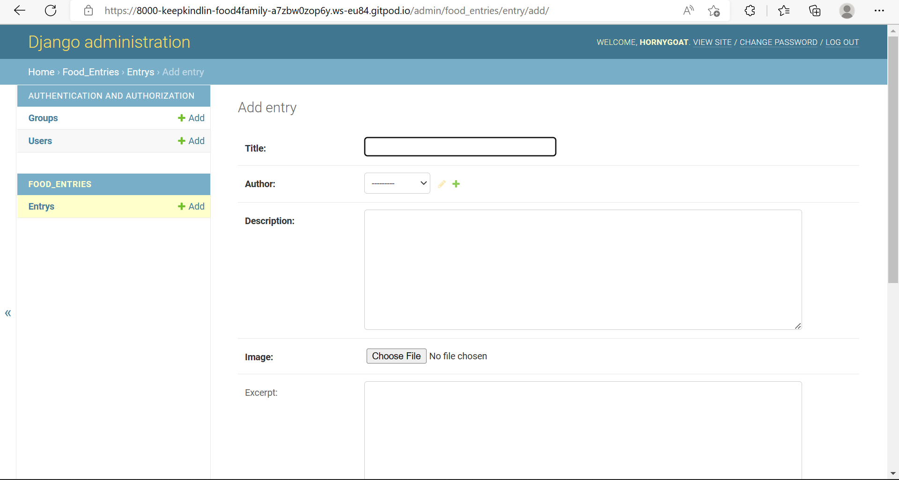

# food4family 

food4family is a django food-diary site that allows user's to create, read, update and delete recipe post's or as I have been calling them throughout the project 'Entries'. I believe the color scheme in the site represents a healthy and natural mindset. There are many features listed in this file that ideally would have been implemented but due to time constraints and low confidence in my knowlegde, I was unable to add them to the project.

## Primary Goal for the Site
The goal for this site is to provide users with the capability to track what food they are consuming with their families and which recipes they enjoy making with the primary focus being about eating healthy.

## Planning
This project has been built whilst following the Agile methodology. The sites User Stories were depicted first utilising the tools of the Kanban board on github pages, then followed by the UX Design of all necessary pages. This project originally had 9 User Stories but has since been cut down to 4 for a time-related reason.

## User Stories

During the planning stage of this site, I had a handful of user stories that were well thought out and would clearly have a positive effect on the users but as I encountered issues such as low knowlegde and time, I eventually had to mark most as invalid but were left as part of the project as proof as to what the site could have been. 

- View Likes - As a site user, I can view how many likes a recipe entry has, so I can see which is most popular.
- Additional Entry Information - As a site user, I can click on a recipe by another user, so I can view more detail about it.
- Like and Unlike - As a site user, I can like and unlike recipe entries, so I can positively interact with other user's.
- View Other Users Entries - As a site user, I can go to one page to find all the recipes by other user's, so that I can like and learn from new recipes. 
- Viewing Entry List - As a site user, I can view my entries as a list, so that I can easily navigate between them.
- Approve Entries - As a site admin, I can review user entries before they are published, so that I can approve appropriate posts.
- Filtering Entries - As a site user, I can have the option to filter my entries, so that I can find a specific post or posts quickly.
- Entry Management - As a site user, I can create, read, update and delete entries, so that I can manage my records.
- Account Registration - As a site user, I can register an account, so that I can keep a record of my recipes and view others recipes.

### Additional User Stories
These stories were added after needing another custom model. They were designed following the idea behind the model which was to alow user's to add a family name upon registration and login so they can see their family members who use the site and view there posts.

- As a site user, I can enter a family name, so that I can see what foods my family members enjoy.

- As a site user, I can see a list of all recipe's by other members of my family, so that I can check for their latest updates.

- As a site user, I can click on a recpie by a family member, so that I can view it for additional information.

- As a site user, only I can update or delete recipe entries, so I can keep track of what I have recently added, changed or deleted.

- As a site user, I can register as head of the family, so that I can add family members to my family account. 

- As a site user, I can sign into my family account using a password, so only my family members can join on the site.

- As a site admin, I can see the family name of a post, so I can group all posts by that family.

## Features

### Existing Features

#### Navbar:

The navbar exists in the base.html file and is extended into all urls so it is always present on the page. Since the site is aimed at users who want to be healthier, I decided the best color scheme would be green and orange/brown as they are mostly assosiated with nature and good for you.

On the left is the logo 'food4family' and is distinguishable by its font being different from the rest of the sites font. I used 'Itim, cursive;' for the logo.

Next to the logo is the simple navbar. When logged in, it shows 'My Recipes' and 'Logout' (My Recipes being the landing page after successfully signing in)

On the far right is a short message to keep users comfortable with the site and as a constant but gentle reminder why they are using this site to begin with. I liked styling it the same as the logo but with the regular font for the page which is 'Indie Flower, cursive;'.

This is how the navbar looks upon entering the site but not yet logged in. The only options are 'Register' where users can create an account, and login (login being the landing page for users new to the site)

#### Recipe List Display:

Not yet ready

#### Recipe Entry Information:

Not yet ready

#### Footer:

This is the footer that also lives inside base.html so it occurs on each page of the site. A short description of who completed the project like a signature. The few fontawesome Icons add a level of proffessionalism where in the future, users can use them as legitamite links to follow me on different platforms. I thought brown being very close to green in nature would work nicely as a footer.

#### Sign-in Form:

The sign-in form has a pleasent greeting that doesnt waste a user's time reading. It had to be simple and keeping with the color scheme lightly. The link that navigates to the registration form and the button for signing in are both 'rgb(31, 129, 31)' (green). I even added a checkbox for 'remember me' to make access to the site more fluent.

#### Sign-out Page:

The page for logging off is very plain as I needed to dedicate more time towards other essential features. But a warm goodbye message and an easy button press to logout to mkae life easier for the user

#### Registration Page/Form:

The registration form is enthusiastic to motivate people to create an account with us. It is all very easy to use as users only need to type in a unique username and a valid password which they will then need to confirm. Email address is optional and serves no purpose other than adding more to the form. 

## Features for the Future

Add functionality to like, comment and share recipes so the site is more interactive.

Have a seperate tab that links to up and coming food bloggers on youtube, instagram and other social sites.

## deployment to heroku steps:

- Fist login to heroku and press new to click create new app
- Name the app and select your region
- Navigate to the settings section and scroll down to config vars
- Clcik 'reveal config vars' and add CLOUDINARY_URL, DATABASE_URL, DISABLE_COLLECTSTATIC, PORT and SECRET_KEY
- Go to the Deploy tab and scroll down to select GitHub as your deployment method
- Finally search and connect to your current repository, scroll down once more to manual deploy and click deploy branch
- Successfully Deployed: 

## creating elephantsql database steps 
- First login to elephantsql
- select new instance and give it a name
- Then choose a region and data center (the same thing)
- upon reviewing the details, click create instance
- copy the url and add it into your env.py file
- migrate changes to settings.py file and check the database is working by navigating to the browser option on the elephantsql instance and then clicking table queries. 
- If you can see a number of different rows, it has been successful
- Finally, commit and push changes to your project so the database url is saved

## Creating a superuser
I only created one admin for the site so I could easily manage entries pending approval . I created the admin by using 'python3 manage.py createsuperuser'. The details are as follows:
- Username:  hornygoat

Below is evidence that the admin has been registered and also that my first model 'Entry' has been added correctly:

## Credits
Massive thankyou to Tutor Oisin for helping me figure out how to alter the allauth form using inheritance and overriding and Tutor Martin for helping me change my landing page and redirecting the landing page to register page
My mentor Brian for insight and support
The slack community for ongoing helpful discussions
