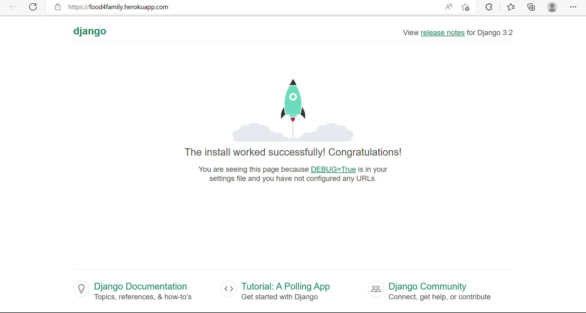

# food4family 

## deployment to heroku steps

- Fist login to heroku and press new to click create new app
- Name the app and select your region
- Navigate to the settings section and scroll down to config vars
- Clcik 'reveal config vars' and add CLOUDINARY_URL, DATABASE_URL, DISABLE_COLLECTSTATIC, PORT and SECRET_KEY
- Go to the Deploy tab and scroll down to select GitHub as your deployment method
- Finally search and connect to your current repository, scroll down once more to manual deploy and click deploy branch
- Successfully Deployed: 

## creating elephantsql database steps 
- First login to elephantsql
- select new instance and give it a name
- Then choose a region and data center (the same thing)
- upon reviewing the details, click create instance
- copy the url and add it into your env.py file
- migrate changes to settings.py file and check the database is working by navigating to the browser option on the elephantsql instance and then clicking table queries. 
- If you can see a number of different rows, it has been successful
- Finally, commit and push changes to your project so the database url is saved